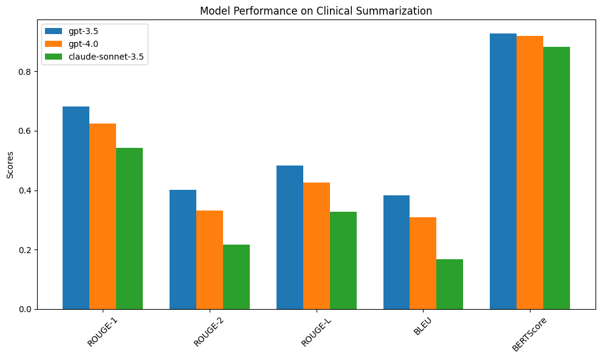

# Evaluating LLM Performance for SOAP Note Generation

This project benchmarks the ability of large language models to generate accurate and structured **SOAP notes** from **doctor-patient conversations**. The task focuses on evaluating how well models perform **clinical summarization** in the standard **SOAP format**:  
**Subjective, Objective, Assessment, Plan**.

---

## Task Overview

- **Objective**: Evaluate LLMs on the generation of SOAP notes from unstructured medical dialogue.
- **Input**: 50 patient-doctor conversations from a medical dataset.
- **Output**: Structured SOAP notes generated by each model.
- **Setup**: Few-shot prompting with 2 example pairs included in every input.

---

## Models Evaluated

| Model               | Version / ID                   |
|--------------------|--------------------------------|
| GPT-3.5            | `gpt-3.5-turbo`                |
| GPT-4.0            | `gpt-4`                        |
| Claude Sonnet 3.5  | `claude-3-5-sonnet-20241022`     |

---

## Evaluation Metrics

We evaluated the generated SOAP notes against ground-truth references using the following metrics:

| Metric       | Description |
|--------------|-------------|
| **ROUGE-1**  | Unigram overlap (recall) |
| **ROUGE-2**  | Bigram overlap (phrase-level accuracy) |
| **ROUGE-L**  | Longest common subsequence (fluency/structure) |
| **BLEU**     | Precision of n-gram overlap |
| **BERTScore**| Semantic similarity using contextual embeddings |

---

## Results

### Exact Scores

```text
GPT-3.5:
ROUGE-1:    0.6829
ROUGE-2:    0.4008
ROUGE-L:    0.4837
BLEU:       0.3822
BERTScore:  0.9279

GPT-4.0:
ROUGE-1:    0.6247
ROUGE-2:    0.3308
ROUGE-L:    0.4251
BLEU:       0.3095
BERTScore:  0.9190

Claude Sonnet 3.5:
ROUGE-1:    0.5423
ROUGE-2:    0.2170
ROUGE-L:    0.3273
BLEU:       0.1671
BERTScore:  0.8825
```

---

### Visualization



---

## Interpretation

| Model             | Summary |
|------------------|---------|
| **GPT-3.5**       | Best overall performer across all metrics. It shows excellent lexical overlap (ROUGE), structural faithfulness, and top-tier semantic fidelity (BERTScore 0.9279). Ideal for generating clinical summaries. |
| **GPT-4.0**       | Slightly lower than GPT-3.5 but still strong. High semantic similarity (0.9190 BERTScore) indicates robust understanding, though with more paraphrasing. |
| **Claude Sonnet** | Weaker ROUGE and BLEU scores suggest inconsistent structure or formatting. BERTScore of 0.8825 indicates preserved meaning, but the model may need stricter prompting or fine-tuning for SOAP tasks. |

---

## Conclusion

- **GPT-3.5 is highly recommended** for structured SOAP note generation in clinical NLP tasks.
- **GPT-4.0** is suitable as a close alternative, especially for more natural or paraphrased summaries.
- **Claude Sonnet 3.5** is viable if semantic accuracy alone is sufficient, but formatting fidelity may be a concern.

---


